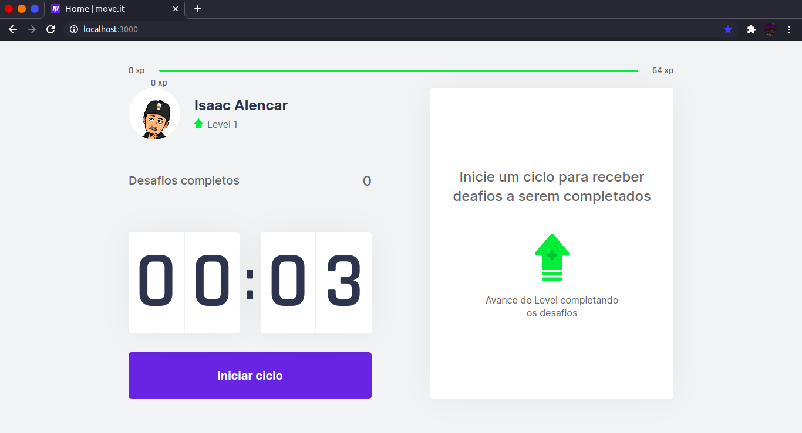

<head>
  <link rel="preconnect" href="https://fonts.gstatic.com">
  <link href="https://fonts.googleapis.com/css2?family=Inter:wght@400;600&display=swap" rel="stylesheet">
</head>

<div align="center">
  
  <p style="font-size: 42px;margin: 20px 0;">move.it</p>
  <div style="display:flex; align-items: center; justify-content: center;">
    
    
    
  </div>
</div>

## Índice
- [Sobre o projeto](#Sobreoprojeto)
- [Preview](#🎨PreviewdoLayoutFinal)
- [Check-in de aprendizado](##Umbrevecheck-indeaprendizadonoprojeto)
- [Tecnologias](###:pencil2:TecnologiasUtilzadas)
- [Como começar](###:boom:Comorodaroprojeto)


# Sobre o Projeto
<p style="font-family:'Inter', sans-serif; font-size: 14px;width: 600px">
  O move.it é um projeto elaborado para a Next Level Week. Um evento promovido
  pela edtech <a href="https://rocketseat.com.br/" blank="_target">Rocketseat</a>.
  Que nesta edição (a 4ª edição), promoveu uma imersão intensa em desenvolvimento web.<br />
  Essa é trilha React, onde ao fim de 1 semana de conteúdo intenso, desenvolvemos
  uma aplicação com React e o seu framework Next.js. <br />
</p>

# 🎨 Preview do Layout Final
<div align="center">
  


<div 
  style="display: flex; align-items: center; justify-content: space-around; width: 250px; height: 35px; background-color: #4953B8; border-radius: 5px; padding: 5px; margin: 20px 0;"
>
  
  <strong style="font-family: 'Inter', sans-serif">
    <a href="" style="color: inherit; text-decoration: none;">
      Veja o app funcionando.
    </a>
  </strong>
</div>

</div>

## Um breve check-in de aprendizado no projeto
### **React**  
- Componentes funcionais [x]
- React Hooks [x]
- Context APi [x]
- Reaproevitamento de componentes [x];
### **Nextjs**  
- CSS modules [x];
- Server Side Rendering [x];
- Next e Typescript [x];
### **API do Browser**  
- Notifications [x]
- Áudios [x]

###  :pencil2: Tecnologias Utilzadas
- ### [React](https://pt-br.reactjs.org/)
- ### [Next.js](https://nextjs.org/)
- ### [Node.js](https://nodejs.org/en/)
- ### [Yarn](https://yarnpkg.com/) ou você pode utilizar o npm que já vem com o Node.js
- ### [Git](https://git-scm.com/book/en/v2)
- ### [js-cookie](https://github.com/js-cookie/js-cookie)

###  :boom: Como rodar o projeto
<p style="font-family:'Inter', sans-serif; font-size: 14px;">
  Primeiramente, certifique-se de que você tem o mínimo necessário para começar:
</p>
<ul>
  <li>
    Node e Git;
  </li>
</ul>

Então...

### 1- Clone o repositório
```bash
  git clone https://github.com/Isaac-alencar/moveit.git path/to/your/directory
```
### 2- no terminal

```bash
  # para npm 
  cd path/to/your/directory && npm run dev

  # para yarn
  cd path/to/your/directory && yarn dev

  # acesse no browser http://localhost:3000/
```